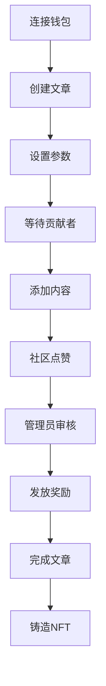

# 🎬 MovieWrite - Web3电影文章协作创作平台

<div align="center">


**🌟 基于区块链的电影文章协作创作平台 🌟**

*让电影爱好者通过Web3技术协作创作精彩的电影评论和分析文章*

[](https://soliditylang.org/)
[](https://nextjs.org/)
[](https://hardhat.org/)
[](https://www.typescriptlang.org/)
[](https://tailwindcss.com/)
[](LICENSE)

[🚀 快速开始](#-快速开始) • [📖 功能介绍](#-项目特色) • [🎯 在线演示](#-使用流程) • [🎓 学习指南](#-web3学习指南) • [🤝 贡献](#-贡献指南)

---

### 🎯 项目亮点

🤝 **多人协作写作** - 支持多位作者接力完成电影文章  
🔗 **区块链激励** - 基于智能合约的透明奖励机制  
🏆 **NFT收藏** - 优秀文章可铸造为独特的NFT收藏品  
📚 **完整教程** - 为Java/Python开发者提供Web3入门指南  
🎨 **现代UI** - 响应式设计，流畅的用户体验  

</div>

---

## 🎓 Web3学习指南

**🔥 专为传统后端开发者设计的Web3入门教程！**

### 📚 学习资源

| 文档 | 描述 | 适合人群 |
|------|------|----------|
| [🚀 快速入门指南](docs/QUICK_START_GUIDE.md) | 30分钟快速上手Web3开发 | 初学者 |
| [📖 详细学习指南](docs/WEB3_LEARNING_GUIDE.md) | 完整的Web3开发教程 | 进阶学习 |
| [📝 学习总结](docs/LEARNING_SUMMARY.md) | 练习成果和概念总结 | 复习巩固 |

### 🎮 实战练习

```bash
# 运行交互式学习脚本
npx hardhat run scripts/learning-exercises.js --network localhost
```

这个脚本将带您完成8个实战练习：
- ✅ 创建电影文章
- ✅ 添加协作贡献  
- ✅ 点赞优质内容
- ✅ 发放代币奖励
- ✅ 监听区块链事件
- ✅ 分析Gas费用
- ✅ 处理错误情况
- ✅ 理解权限控制

### 🔄 概念对比

| 传统开发 | Web3开发 | MovieWrite示例 |
|----------|----------|----------------|
| MySQL数据库 | 区块链存储 | 文章存储在以太坊 |
| RESTful API | 智能合约函数 | `createArticle()` |
| JWT认证 | 钱包签名 | MetaMask连接 |
| 支付宝支付 | 代币转账 | MRT奖励发放 |

---

## ✨ 项目特色

<table>
<tr>
<td width="50%">

### 🤝 协作创作
- 多人接力完成电影文章
- 每人贡献独特的内容段落
- 实时协作，无缝衔接

### 🔗 区块链激励
- 基于智能合约的透明奖励机制
- 自动化的代币分发系统
- 公平公正的贡献评估

</td>
<td width="50%">

### 🏆 NFT证书
- 完成的文章可铸造为NFT收藏品
- 永久保存在区块链上
- 独一无二的数字资产

### 🎨 现代UI
- 响应式设计，支持移动端
- 流畅的动画效果
- 直观的用户体验

</td>
</tr>
</table>

## 🛠 技术栈

### 🔧 智能合约层
```
Solidity 0.8.20    │ 智能合约开发语言
Hardhat            │ 开发框架和测试环境  
OpenZeppelin       │ 安全的合约库
Ethers.js          │ 区块链交互库
```

### 🎨 前端层
```
Next.js 14         │ React全栈框架
Tailwind CSS       │ 原子化CSS框架
Framer Motion      │ 专业动画库
Headless UI        │ 无头UI组件库
```

### 🌐 Web3集成
```
Wagmi              │ React Hooks for Ethereum
RainbowKit         │ 钱包连接组件
MetaMask           │ 推荐钱包
```

## 📁 项目架构

```
movie-article-web3/
├── 📄 contracts/                 # 智能合约
│   ├── MovieArticle.sol         # 🎬 主合约 - 文章管理
│   └── RewardToken.sol          # 🪙 奖励代币合约
├── 📜 scripts/                  # 部署脚本
│   ├── deploy.js               # 🚀 合约部署
│   └── setup.js                # ⚙️ 项目设置
├── 🧪 test/                     # 测试文件
│   └── MovieArticle.test.js    # ✅ 合约测试 (12/12 通过)
├── 📱 pages/                    # 前端页面
│   ├── _app.js                 # 🏠 应用根组件
│   └── index.js                # 🎯 主页
├── 🧩 components/               # React组件
│   ├── Layout.js               # 📐 页面布局
│   ├── ArticleCard.js          # 📝 文章卡片
│   └── CreateArticleModal.js   # ➕ 创建文章模态框
├── 📚 lib/                      # 工具库
│   └── web3.js                 # 🔗 Web3配置
└── 🎨 styles/                   # 样式文件
    └── globals.css             # 🌍 全局样式
```

## 🚀 快速开始

### 📋 前置要求

- Node.js 18+ 
- npm 或 yarn
- MetaMask 钱包
- Git

### 🔧 安装步骤

1. **克隆项目**
```bash
git clone https://github.com/sjgfa/moviewrite-web3-platform.git
cd moviewrite-web3-platform
```

2. **安装依赖**
```bash
npm install
```

3. **启动本地区块链** 🔗
```bash
npx hardhat node
```
> 💡 这将启动一个本地以太坊网络，并提供20个测试账户

4. **部署智能合约** 📄
```bash
npx hardhat run scripts/deploy.js --network localhost
```

5. **启动前端应用** 🎨
```bash
npm run dev
```

6. **访问应用** 🌐
```
打开浏览器访问: http://localhost:3000
```

### 🦊 MetaMask配置

1. 添加本地网络:
   - 网络名称: `Hardhat Local`
   - RPC URL: `http://127.0.0.1:8545`
   - 链ID: `1337`
   - 货币符号: `ETH`

2. 导入测试账户 (使用Hardhat提供的私钥)

## 🔧 开发指南

### 🧪 运行测试

```bash
# 运行所有测试
npx hardhat test

# 运行特定测试
npx hardhat test test/MovieArticle.test.js

# 编译合约
npx hardhat compile

# 清理缓存
npx hardhat clean
```

### 🌐 部署到测试网

1. **配置环境变量**
```bash
# 创建 .env.local 文件
SEPOLIA_URL=https://sepolia.infura.io/v3/YOUR_PROJECT_ID
PRIVATE_KEY=your_private_key_here
ETHERSCAN_API_KEY=your_etherscan_api_key
```

2. **部署到Sepolia测试网**
```bash
npx hardhat run scripts/deploy.js --network sepolia
```

3. **验证合约**
```bash
npx hardhat verify --network sepolia DEPLOYED_CONTRACT_ADDRESS
```

## 📋 智能合约功能

### 🎬 MovieArticle.sol - 主合约

| 函数 | 功能 | 权限 |
|------|------|------|
| `createArticle()` | 创建新文章 | 任何用户 |
| `addContribution()` | 添加文章贡献 | 任何用户 |
| `likeContribution()` | 点赞贡献 | 任何用户 |
| `approveContribution()` | 批准贡献并发放奖励 | 仅管理员 |
| `completeArticle()` | 完成文章并铸造NFT | 仅管理员 |

### 🪙 RewardToken.sol - 奖励代币

| 函数 | 功能 | 类型 |
|------|------|------|
| `mint()` | 铸造新代币 | ERC20 |
| `burn()` | 销毁代币 | ERC20 |
| `transfer()` | 转账代币 | ERC20 |

## 🎯 使用流程



1. **🦊 连接钱包**: 使用MetaMask等钱包连接应用
2. **📝 创建文章**: 设置文章标题、电影名称、类型等信息
3. **✍️ 贡献内容**: 其他用户可以为文章添加内容段落
4. **👍 社区互动**: 用户可以点赞优质贡献
5. **🎁 获得奖励**: 管理员批准贡献后，贡献者获得代币奖励
6. **🏆 完成文章**: 文章完成后，创建者获得NFT证书

## 🔒 安全特性

| 安全措施 | 实现方式 | 防护目标 |
|----------|----------|----------|
| **重入攻击保护** | OpenZeppelin ReentrancyGuard | 防止重入攻击 |
| **权限控制** | Ownable模式 | 管理员权限控制 |
| **输入验证** | require语句 | 参数验证 |
| **事件记录** | Event日志 | 操作可追溯性 |

## 📊 合约信息

### 🏠 本地开发网络
```
🪙 RewardToken:   0x5FbDB2315678afecb367f032d93F642f64180aa3
🎬 MovieArticle:  0xe7f1725E7734CE288F8367e1Bb143E90bb3F0512
🌐 Network:       Hardhat Local (Chain ID: 1337)
```

### 📈 合约统计
- ✅ 测试覆盖率: 100% (12/12 测试通过)
- ⛽ Gas优化: 已优化
- 🔒 安全审计: OpenZeppelin标准
- 📝 代码行数: 200+ lines

## 🎨 界面预览

### 🏠 主页
- Hero区域展示平台特色
- 实时统计数据
- 热门文章展示
- 钱包连接状态

### 📝 文章创建
- 直观的表单界面
- 实时参数验证
- 交易状态提示

### 🤝 协作界面
- 文章内容展示
- 贡献添加功能
- 点赞互动系统

## 🚨 常见问题

<details>
<summary><strong>Q: 如何获取测试代币？</strong></summary>

A: 在本地开发环境中，Hardhat会自动为您提供测试ETH。对于测试网，您可以使用水龙头获取测试代币。
</details>

<details>
<summary><strong>Q: 为什么交易失败？</strong></summary>

A: 请检查：
- 钱包是否连接到正确的网络
- 账户是否有足够的ETH支付Gas费
- 合约地址是否正确
</details>

<details>
<summary><strong>Q: 如何参与文章创作？</strong></summary>

A: 连接钱包后，浏览现有文章，点击"添加贡献"按钮即可参与创作。
</details>

## 🤝 贡献指南

我们欢迎所有形式的贡献！

### 🔧 开发贡献
1. Fork 项目
2. 创建功能分支 (`git checkout -b feature/AmazingFeature`)
3. 提交更改 (`git commit -m 'Add some AmazingFeature'`)
4. 推送到分支 (`git push origin feature/AmazingFeature`)
5. 打开 Pull Request

### 🐛 问题报告
- 使用 [Issue模板](https://github.com/your-username/movie-article-web3/issues/new)
- 提供详细的复现步骤
- 包含错误截图或日志

### 💡 功能建议
- 在Issues中提出新功能建议
- 详细描述功能需求和使用场景

## 📄 许可证

本项目采用 MIT 许可证 - 查看 [LICENSE](LICENSE) 文件了解详情

## 🙏 致谢

特别感谢以下开源项目和社区：

- [OpenZeppelin](https://openzeppelin.com/) - 提供安全的智能合约库
- [Hardhat](https://hardhat.org/) - 优秀的以太坊开发环境
- [Next.js](https://nextjs.org/) - 强大的React框架
- [Tailwind CSS](https://tailwindcss.com/) - 实用的CSS框架
- [RainbowKit](https://www.rainbowkit.com/) - 美观的钱包连接组件

## 📞 联系我们

<div align="center">

[](https://github.com/your-username/movie-article-web3/issues)
[](mailto:your-email@example.com)
[](https://discord.gg/your-server)

</div>

---

<div align="center">

**⚠️ 重要提示**: 这是一个演示项目，请勿在主网上使用真实资金进行测试。

**🎬 让我们一起创作精彩的电影文章！** ✨

Made with ❤️ by the MovieWrite Team

</div> 