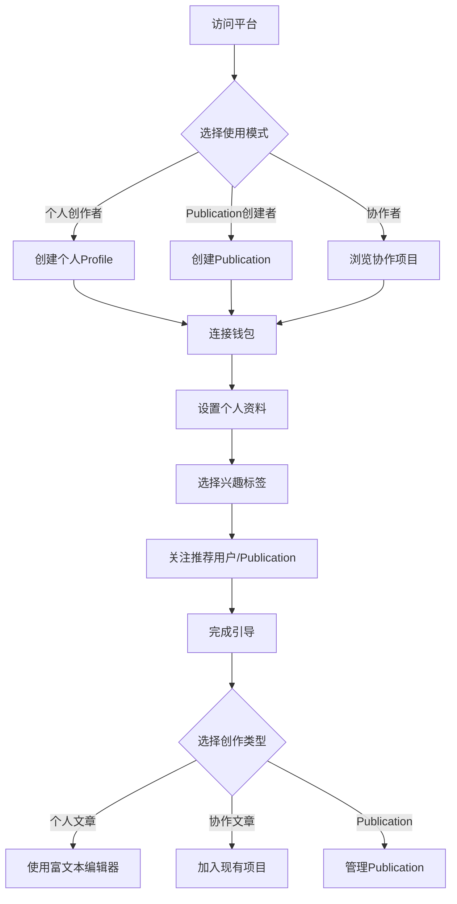
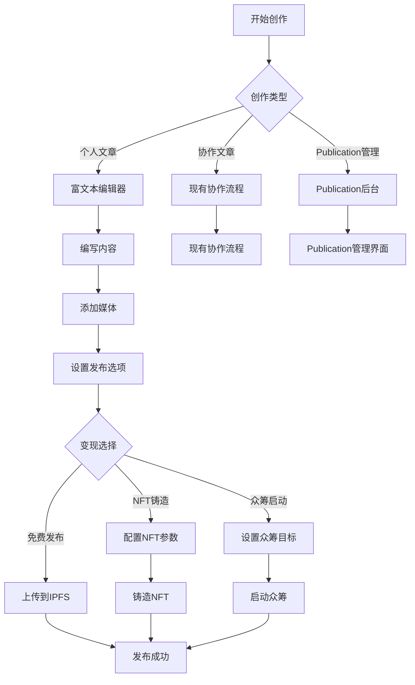
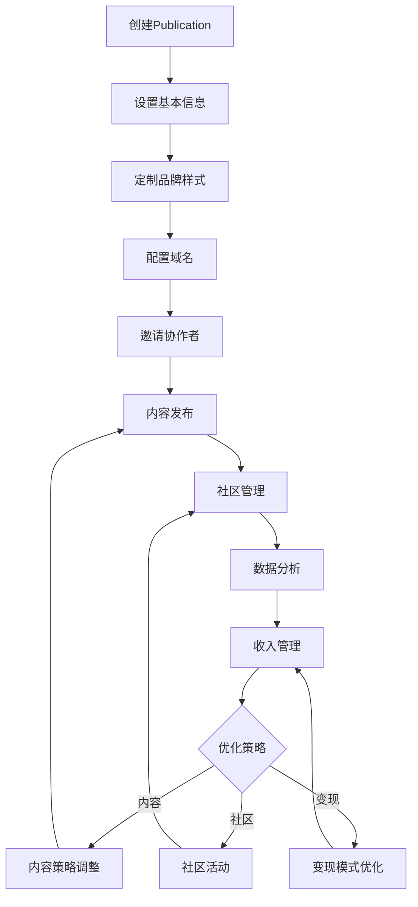
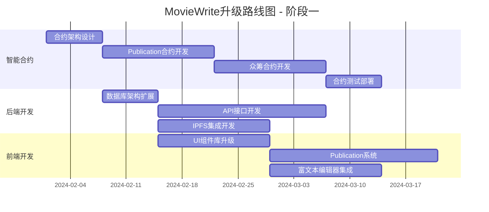
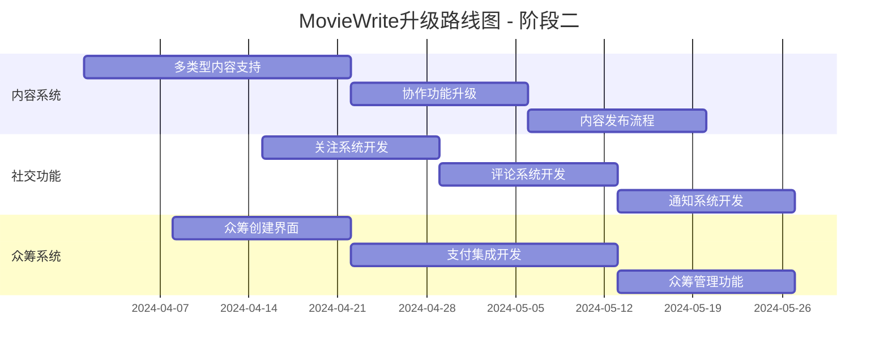
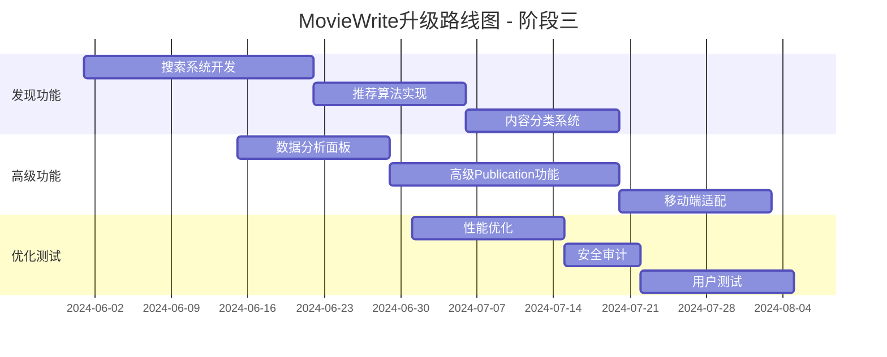

# 🎬➡️📝 MovieWrite 向 Mirror.xyz 风格转型 PRD

## 📊 项目现状分析

### 当前 MovieWrite 架构特点
- **领域聚焦**: 专注电影文章协作创作
- **协作模式**: 多人接力式贡献内容
- **技术栈**: Next.js + Hardhat + OpenZeppelin
- **核心功能**: 文章创建、贡献添加、点赞系统、NFT证书

### Mirror.xyz vs MovieWrite 差异对比

| 维度 | Mirror.xyz | 当前 MovieWrite | 改造机会 |
|------|------------|----------------|----------|
| **内容范围** | 全领域内容发布平台 | 专注电影文章 | 🚀 扩展到全内容类型 |
| **创作模式** | 个人独立创作 + Publication系统 | 多人协作创作 | 🔄 结合两种模式 |
| **商业模式** | NFT铸造 + 众筹 + 订阅 | NFT证书 + 代币奖励 | 💰 增强变现能力 |
| **存储方案** | IPFS + Arweave双重保障 | 链上存储 | 📦 升级存储架构 |
| **编辑器** | 富文本编辑器 | 基础文本输入 | ✨ 升级编辑体验 |
| **社区功能** | 关注、评论、发现 | 点赞系统 | 👥 构建社区生态 |

## 🎯 产品愿景与定位

### 新产品愿景
将 MovieWrite 升级为 **"内容创作者经济平台"**，结合 Mirror.xyz 的去中心化发布优势与原有的协作创作特色，打造独特的内容创作生态。

### 核心差异化优势
1. **双重创作模式**: 支持个人创作 + 协作创作
2. **垂直领域深耕**: 在通用平台基础上保持影视娱乐优势
3. **创新经济模型**: NFT + 众筹 + 协作奖励的混合模式
4. **社区治理**: DAO机制与创作者权益保护

## 🏗️ 技术架构升级设计

### 现有架构保留与升级
```typescript
// 保留并升级的核心合约
interface UpgradedArchitecture {
  // 1. 扩展现有 MovieArticle 合约
  contentContract: {
    extends: "MovieArticle.sol";
    newFeatures: [
      "Publication系统",
      "个人独立创作",
      "内容分类系统",
      "众筹功能"
    ];
  };
  
  // 2. 新增去中心化存储
  storageLayer: {
    ipfs: "内容永久存储";
    arweave: "重要内容备份";
    traditional: "性能优化缓存";
  };
  
  // 3. 升级前端架构
  frontend: {
    editor: "Tiptap富文本编辑器";
    ui: "升级到Shadcn/ui设计系统";
    features: "Publication管理系统";
  };
}
```

### 新增技术组件
```typescript
interface NewTechStack {
  // IPFS集成
  ipfsIntegration: {
    provider: "Pinata";
    features: ["内容上传", "元数据存储", "媒体文件管理"];
  };
  
  // 富文本编辑器
  editor: {
    framework: "Tiptap";
    extensions: ["Markdown", "媒体嵌入", "代码块", "数学公式"];
  };
  
  // Publication系统
  publicationSystem: {
    customDomains: "用户自定义域名";
    themes: "可定制主题系统";
    collaboration: "多作者协作";
  };
  
  // 众筹系统
  crowdfunding: {
    goals: "灵活目标设置";
    rewards: "分级奖励机制";
    transparency: "资金使用透明";
  };
}
```

## 🚀 功能升级计划

### 第一阶段：基础功能扩展 (4-6周)

#### 1.1 内容类型扩展
```typescript
interface ContentTypeExpansion {
  // 从单一电影文章扩展到多种内容类型
  contentTypes: {
    // 保留原有功能
    collaborativeArticles: {
      movies: "电影文章协作";
      tv: "电视剧分析";
      entertainment: "娱乐资讯";
    };
    
    // 新增个人创作
    individualContent: {
      blog: "个人博客";
      analysis: "深度分析";
      news: "新闻报道";
      tutorial: "教程指南";
    };
    
    // 新增媒体类型
    mediaTypes: {
      longform: "长文章";
      newsletter: "新闻简报";
      guide: "指南教程";
      review: "评测评论";
    };
  };
}
```

#### 1.2 Publication系统构建
```typescript
interface PublicationSystem {
  // 基于现有用户系统扩展
  publicationFeatures: {
    creation: {
      setupWizard: "创建引导流程";
      branding: "品牌定制选项";
      domain: "自定义子域名"; // username.moviewrite.xyz
    };
    
    management: {
      contentOrganization: "内容分类管理";
      collaboratorInvites: "协作者邀请";
      analyticsBasic: "基础数据分析";
    };
    
    monetization: {
      nftMinting: "内容NFT化";
      subscriptions: "订阅模式";
      donations: "打赏功能";
    };
  };
}
```

### 第二阶段：编辑体验升级 (3-4周)

#### 2.1 富文本编辑器集成
```typescript
interface EditorUpgrade {
  // 替换现有简单文本输入
  tiptapIntegration: {
    // 基础功能
    formatting: ["粗体", "斜体", "标题", "列表", "链接"];
    
    // 媒体支持
    media: {
      images: "拖拽上传到IPFS";
      videos: "YouTube/Vimeo嵌入";
      embeds: "Twitter/GitHub嵌入";
    };
    
    // 高级功能
    advanced: {
      codeBlocks: "代码高亮";
      tables: "表格支持";
      math: "数学公式";
      comments: "协作评论";
    };
  };
  
  // 保留协作特色
  collaborativeFeatures: {
    realTimeEdit: "实时协作编辑";
    suggestionMode: "建议模式";
    versionHistory: "版本历史";
  };
}
```

#### 2.2 IPFS存储集成
```typescript
interface IPFSIntegration {
  // 升级现有链上存储
  storageStrategy: {
    // 内容存储
    content: {
      ipfs: "文章内容 → IPFS";
      metadata: "元数据 → IPFS";
      media: "媒体文件 → IPFS";
    };
    
    // 性能优化
    caching: {
      cdn: "Cloudflare CDN加速";
      pinning: "Pinata固定服务";
      backup: "多节点备份";
    };
    
    // 向后兼容
    migration: {
      existingContent: "现有内容迁移";
      dualStorage: "双重存储过渡";
      gradualMigration: "渐进式迁移";
    };
  };
}
```

### 第三阶段：社区与发现功能 (4-5周)

#### 3.1 社交功能构建
```typescript
interface SocialFeatures {
  // 基于现有点赞系统扩展
  socialGraph: {
    following: {
      users: "关注用户";
      publications: "关注Publication";
      topics: "关注话题标签";
    };
    
    interactions: {
      likes: "点赞系统(保留现有)";
      comments: "评论功能";
      shares: "分享功能";
      bookmarks: "收藏功能";
    };
    
    notifications: {
      realTime: "实时通知";
      email: "邮件摘要";
      activity: "活动订阅";
    };
  };
}
```

#### 3.2 内容发现与推荐
```typescript
interface DiscoverySystem {
  // 新增发现机制
  discovery: {
    trending: {
      algorithm: "基于点赞数和评论数";
      timeWindow: "24h/7d/30d趋势";
      categories: "分类趋势";
    };
    
    personalized: {
      following: "关注内容流";
      recommendations: "个性化推荐";
      similarContent: "相似内容推荐";
    };
    
    search: {
      fullText: "全文搜索";
      tags: "标签搜索";
      users: "用户搜索";
      publications: "Publication搜索";
    };
  };
}
```

### 第四阶段：经济模型升级 (5-6周)

#### 4.1 众筹系统开发
```typescript
interface CrowdfundingSystem {
  // 新增众筹功能
  campaignManagement: {
    creation: {
      goalSetting: "灵活目标设置";
      timeline: "时间线管理";
      rewards: "分级奖励设计";
      updates: "进度更新功能";
    };
    
    contribution: {
      cryptoPayments: "加密货币支付";
      fiatOnRamp: "法币入金";
      recurringSupport: "订阅式支持";
    };
    
    transparency: {
      fundTracking: "资金追踪";
      milestoneReporting: "里程碑报告";
      refundMechanism: "退款机制";
    };
  };
}
```

#### 4.2 NFT系统增强
```typescript
interface EnhancedNFT {
  // 升级现有NFT功能
  nftEnhancements: {
    // 保留现有文章NFT
    articleNFTs: {
      individual: "个人文章NFT";
      collaborative: "协作文章NFT(现有)";
      collections: "文章系列NFT";
    };
    
    // 新增Publication NFT
    publicationNFTs: {
      membership: "Publication会员NFT";
      exclusive: "独家内容NFT";
      governance: "治理投票NFT";
    };
    
    // 增强功能
    features: {
      royalties: "版税分配";
      utilities: "实用功能";
      metadata: "丰富元数据";
    };
  };
}
```

## 👥 用户体验流程设计

### 新用户引导流程


### 内容创作流程升级


### Publication运营流程


## 💰 商业模式设计

### 多元化收入模式
```typescript
interface RevenueModel {
  // 平台收入
  platformRevenue: {
    // 现有收入保留
    nftMinting: "NFT铸造手续费 2.5%";
    
    // 新增收入来源
    crowdfunding: "众筹成功手续费 5%";
    publicationPremium: "高级Publication功能 $20/月";
    customDomains: "自定义域名 $10/月";
    prioritySupport: "优先技术支持 $50/月";
    advertisingRevenue: "精准广告投放";
  };
  
  // 创作者收入
  creatorRevenue: {
    // 保留现有
    collaborativeRewards: "协作奖励分配";
    nftSales: "NFT销售收入";
    
    // 新增来源
    subscriptions: "订阅收入";
    crowdfunding: "众筹资金";
    tips: "打赏收入";
    exclusiveContent: "付费内容";
  };
}
```

### 代币经济模型升级
```typescript
interface TokenEconomics {
  // 现有MWT代币扩展
  mwtToken: {
    // 保留功能
    collaborationRewards: "协作奖励";
    governance: "平台治理";
    
    // 新增功能
    staking: "质押获得收益";
    premiumAccess: "高级功能访问";
    contentBoost: "内容推广加速";
    publicationLicense: "Publication许可";
  };
  
  // 新增代币机制
  nftUtility: {
    membershipBenefits: "VIP会员权益";
    exclusiveContent: "独家内容访问";
    votingRights: "创作者DAO投票权";
    revenueSharing: "平台收入分红";
  };
}
```

## 🛠️ 技术实施方案

### 智能合约升级计划
```solidity
// 扩展现有合约架构
contract MovieWriteV2 is MovieArticle {
    // 新增Publication功能
    struct Publication {
        uint256 id;
        address owner;
        string name;
        string domain;
        string metadataURI;
        bool isPremium;
        uint256 createdAt;
    }
    
    // 新增众筹功能
    struct CrowdfundCampaign {
        uint256 id;
        address creator;
        uint256 goal;
        uint256 raised;
        uint256 deadline;
        string contentHash;
        bool isActive;
    }
    
    // 新增内容类型
    enum ContentType {
        CollaborativeArticle,  // 现有协作文章
        IndividualArticle,     // 新增个人文章
        Newsletter,            // 新增新闻简报
        Tutorial               // 新增教程
    }
    
    // 扩展文章结构
    struct ArticleV2 {
        // 保留现有所有字段
        uint256 id;
        string title;
        string contentHash;    // 新增IPFS哈希
        ContentType contentType; // 新增内容类型
        uint256 publicationId; // 新增Publication关联
        address[] collaborators; // 新增协作者列表
        bool isCrowdfunded;    // 新增众筹标识
    }
}
```

### 数据库架构扩展
```sql
-- 扩展现有数据库
-- 新增Publications表
CREATE TABLE publications (
    id SERIAL PRIMARY KEY,
    owner_address VARCHAR(42) NOT NULL,
    name VARCHAR(255) NOT NULL,
    slug VARCHAR(255) UNIQUE NOT NULL,
    description TEXT,
    custom_domain VARCHAR(255),
    theme_config JSONB DEFAULT '{}',
    is_premium BOOLEAN DEFAULT FALSE,
    created_at TIMESTAMP DEFAULT NOW()
);

-- 扩展现有articles表
ALTER TABLE articles ADD COLUMN content_hash VARCHAR(64);
ALTER TABLE articles ADD COLUMN publication_id INTEGER REFERENCES publications(id);
ALTER TABLE articles ADD COLUMN content_type VARCHAR(50) DEFAULT 'collaborative';
ALTER TABLE articles ADD COLUMN is_crowdfunded BOOLEAN DEFAULT FALSE;

-- 新增众筹表
CREATE TABLE crowdfund_campaigns (
    id SERIAL PRIMARY KEY,
    article_id INTEGER REFERENCES articles(id),
    creator_address VARCHAR(42) NOT NULL,
    goal_amount DECIMAL(36,18) NOT NULL,
    raised_amount DECIMAL(36,18) DEFAULT 0,
    deadline TIMESTAMP NOT NULL,
    is_active BOOLEAN DEFAULT TRUE,
    created_at TIMESTAMP DEFAULT NOW()
);

-- 新增关注表
CREATE TABLE follows (
    id SERIAL PRIMARY KEY,
    follower_address VARCHAR(42) NOT NULL,
    followed_address VARCHAR(42),
    followed_publication_id INTEGER REFERENCES publications(id),
    created_at TIMESTAMP DEFAULT NOW(),
    CHECK (followed_address IS NOT NULL OR followed_publication_id IS NOT NULL)
);
```

### 前端架构升级
```typescript
// 组件架构扩展
interface ComponentArchitecture {
  // 保留现有组件
  existing: {
    Layout: "保留并升级";
    ArticleCard: "扩展支持新内容类型";
    CreateArticleModal: "增强编辑功能";
  };
  
  // 新增组件
  newComponents: {
    // Publication系统
    PublicationDashboard: "Publication管理后台";
    PublicationSettings: "Publication设置";
    PublicationThemeEditor: "主题编辑器";
    
    // 富文本编辑器
    TiptapEditor: "富文本编辑器";
    MediaUploader: "媒体上传组件";
    
    // 社交功能
    FollowButton: "关注按钮";
    CommentSystem: "评论系统";
    NotificationCenter: "通知中心";
    
    // 众筹功能
    CrowdfundingCreator: "众筹创建";
    CrowdfundingCard: "众筹卡片";
    ContributionModal: "贡献弹窗";
  };
}
```

## 📈 成功指标与KPI

### 用户增长指标
```typescript
interface GrowthMetrics {
  userMetrics: {
    totalUsers: {
      month3: "从当前基础增长50%";
      month6: "达到5,000活跃用户";
      month12: "达到20,000活跃用户";
    };
    
    userTypes: {
      individualCreators: "个人创作者 40%";
      publicationOwners: "Publication拥有者 20%";
      collaborators: "协作者 30%";
      consumers: "内容消费者 10%";
    };
    
    retention: {
      day7: "保持现有40%";
      day30: "提升至25%";
      day90: "提升至15%";
    };
  };
}
```

### 内容指标
```typescript
interface ContentMetrics {
  contentGrowth: {
    individualArticles: {
      month3: "500+篇";
      month6: "2,000+篇";
      month12: "8,000+篇";
    };
    
    collaborativeArticles: {
      maintain: "保持现有增长率";
      quality: "提升平均质量分";
    };
    
    publications: {
      month6: "100+个活跃Publication";
      month12: "500+个Publication";
    };
  };
}
```

### 收入指标
```typescript
interface RevenueMetrics {
  platformRevenue: {
    monthlyRecurring: {
      month6: "$2,000+";
      month12: "$10,000+";
    };
    
    transactionFees: {
      month6: "从NFT和众筹获得$5,000+";
      month12: "$25,000+";
    };
  };
  
  creatorEarnings: {
    totalCreatorRevenue: {
      month6: "$20,000+";
      month12: "$100,000+";
    };
    
    averageCreatorIncome: {
      month6: "$50/月";
      month12: "$200/月";
    };
  };
}
```

## 🚀 实施路线图

### 阶段一：基础架构升级 (6-8周)


### 阶段二：核心功能开发 (8-10周)


### 阶段三：生态完善 (6-8周)


## 💎 风险评估与缓解

### 技术风险
```typescript
interface TechnicalRisks {
  migrationRisk: {
    risk: "现有用户数据迁移失败";
    probability: "Medium";
    impact: "High";
    mitigation: [
      "分阶段迁移策略",
      "完整数据备份",
      "回滚计划",
      "用户通知机制"
    ];
  };
  
  performanceRisk: {
    risk: "IPFS访问速度影响用户体验";
    probability: "Medium";
    impact: "Medium";
    mitigation: [
      "CDN加速",
      "多节点部署",
      "本地缓存策略",
      "渐进式加载"
    ];
  };
  
  compatibilityRisk: {
    risk: "新旧功能兼容性问题";
    probability: "Low";
    impact: "Medium";
    mitigation: [
      "向后兼容设计",
      "功能开关机制",
      "用户选择权",
      "逐步迁移"
    ];
  };
}
```

### 市场风险
```typescript
interface MarketRisks {
  competitionRisk: {
    risk: "竞争对手快速跟进";
    mitigation: [
      "差异化定位",
      "技术护城河",
      "社区建设",
      "创新迭代"
    ];
  };
  
  userAdoptionRisk: {
    risk: "现有用户不接受新功能";
    mitigation: [
      "用户调研",
      "渐进式推出",
      "用户教育",
      "激励机制"
    ];
  };
}
```

## 💰 投资预算

### 开发成本估算
```typescript
interface DevelopmentBudget {
  personnel: {
    // 6个月开发周期
    fullStackDeveloper: "$6,000/月 × 2人 × 6月 = $72,000";
    blockchainDeveloper: "$8,000/月 × 1人 × 6月 = $48,000";
    uiuxDesigner: "$5,000/月 × 1人 × 4月 = $20,000";
    productManager: "$6,000/月 × 1人 × 6月 = $36,000";
    total: "$176,000";
  };
  
  infrastructure: {
    cloudServices: "$300/月 × 6月 = $1,800";
    ipfsServices: "$100/月 × 6月 = $600";
    developmentTools: "$500/月 × 6月 = $3,000";
    total: "$5,400";
  };
  
  marketing: {
    communityBuilding: "$10,000";
    contentMarketing: "$8,000";
    partnerships: "$5,000";
    total: "$23,000";
  };
  
  totalBudget: "$204,400";
}
```

### 运营成本 (年度)
```typescript
interface OperationalCosts {
  infrastructure: {
    hosting: "$7,200/年";
    ipfs: "$2,400/年";
    cdn: "$1,800/年";
    monitoring: "$1,200/年";
  };
  
  personnel: {
    maintenance: "$60,000/年";
    communityManagement: "$36,000/年";
    customerSupport: "$24,000/年";
  };
  
  totalAnnual: "$132,600/年";
}
```

## 🎯 总结

MovieWrite向Mirror.xyz风格的转型将是一个革命性的升级，既保留了原有的协作创作特色，又融入了现代化的内容发布平台功能。这次升级将：

### 核心优势
1. **保留差异化**: 协作创作模式仍是独特优势
2. **扩展市场**: 从电影垂直领域扩展到全内容类型
3. **增强变现**: 多元化收入模式提升创作者收益
4. **技术领先**: IPFS + 富文本编辑器提升用户体验
5. **社区驱动**: 完整的社交和发现功能

### 预期收益
- **6个月内**: 实现基础功能升级，用户增长50%
- **12个月内**: 成为综合性内容平台，月收入达到$35,000+
- **长期愿景**: 成为Web3内容创作者经济的重要基础设施

这个改造计划将把MovieWrite从一个专业的电影文章协作平台，升级为具有Mirror.xyz现代化功能的综合性内容平台，同时保持其独特的协作创作优势。