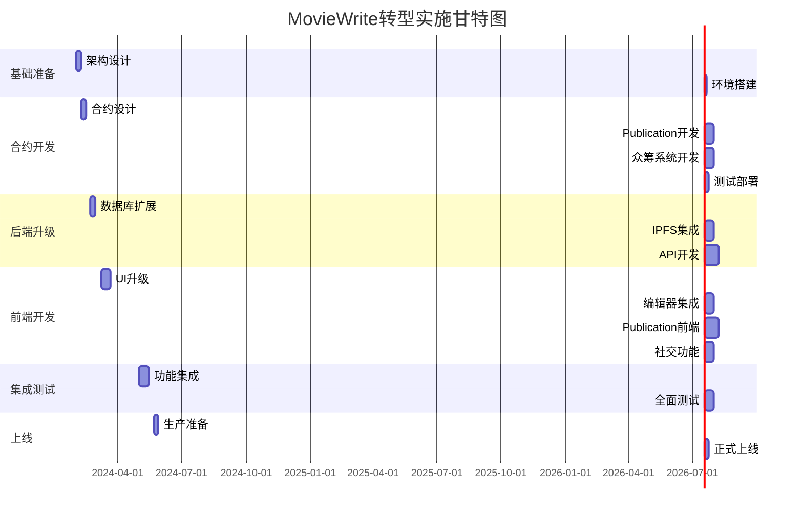

# 🎬 MovieWrite Mirror风格转型 - 实施工作流程

## 📋 执行摘要

将MovieWrite从专注电影文章协作平台转型为综合性内容创作者经济平台，结合Mirror.xyz的去中心化发布优势与原有协作创作特色。

### 核心转型目标
1. **内容扩展**: 从电影文章扩展到全领域内容发布
2. **双重模式**: 保留协作创作 + 新增个人创作
3. **经济升级**: NFT + 众筹 + 订阅的多元化变现
4. **技术提升**: IPFS存储 + 富文本编辑器 + Publication系统
5. **社区构建**: 完整的社交、发现和治理功能

### 实施周期: 20-26周（5-6个月）

## 🏗️ 第一阶段：基础架构准备（第1-2周）

### 1.1 技术评估与架构设计
**负责人**: 架构师 + 全栈开发者  
**预计时间**: 5天

#### 任务清单
- [ ] 评估现有代码库和技术栈
- [ ] 设计新的系统架构图
- [ ] 制定向后兼容策略
- [ ] 确定技术选型（IPFS服务商、编辑器框架等）
- [ ] 创建开发环境配置

#### 交付物
- 系统架构设计文档
- 技术选型报告
- 向后兼容方案
- 开发环境搭建指南

### 1.2 开发环境搭建
**负责人**: DevOps工程师  
**预计时间**: 3天

#### 任务清单
- [ ] 配置IPFS开发环境（Pinata/IPFS节点）
- [ ] 搭建测试网络环境
- [ ] 配置CI/CD管道
- [ ] 设置监控和日志系统
- [ ] 创建开发/测试/生产环境

#### 交付物
- 完整的开发环境
- CI/CD配置文件
- 环境部署文档

## 🔧 第二阶段：智能合约升级（第3-8周）

### 2.1 合约架构设计
**负责人**: 区块链开发者  
**预计时间**: 1周

#### 任务清单
```solidity
// 核心合约升级任务
- [ ] 设计MovieWriteV2合约架构
- [ ] 定义Publication数据结构
- [ ] 设计众筹系统合约
- [ ] 规划NFT功能扩展
- [ ] 设计代币经济模型升级
```

#### 实施代码框架
```solidity
// contracts/MovieWriteV2.sol
contract MovieWriteV2 is MovieArticle, ReentrancyGuard, Pausable {
    // 新增状态变量
    mapping(uint256 => Publication) public publications;
    mapping(uint256 => CrowdfundCampaign) public campaigns;
    mapping(address => uint256[]) public userPublications;
    
    // 新增事件
    event PublicationCreated(uint256 indexed id, address indexed owner);
    event CampaignCreated(uint256 indexed id, uint256 indexed articleId);
    event ContentTypeAdded(uint256 indexed articleId, ContentType cType);
}
```

### 2.2 Publication系统合约开发
**负责人**: 区块链开发者  
**预计时间**: 2周

#### 任务清单
- [ ] 实现Publication创建功能
- [ ] 开发Publication管理功能
- [ ] 实现自定义域名映射
- [ ] 添加协作者权限管理
- [ ] 实现Publication NFT功能

#### 测试用例
```javascript
describe("Publication System", () => {
    it("应该能创建新的Publication", async () => {
        // 测试Publication创建
    });
    it("应该能管理Publication设置", async () => {
        // 测试设置管理
    });
    it("应该能邀请协作者", async () => {
        // 测试协作者系统
    });
});
```

### 2.3 众筹系统合约开发
**负责人**: 区块链开发者  
**预计时间**: 2周

#### 任务清单
- [ ] 实现众筹活动创建
- [ ] 开发资金管理机制
- [ ] 实现里程碑和退款机制
- [ ] 添加透明度报告功能
- [ ] 集成支付网关

### 2.4 合约测试与部署
**负责人**: 区块链开发者 + QA工程师  
**预计时间**: 1周

#### 任务清单
- [ ] 编写完整的单元测试
- [ ] 进行集成测试
- [ ] 执行安全审计
- [ ] 部署到测试网
- [ ] 准备主网部署脚本

## 💾 第三阶段：后端系统升级（第5-10周）

### 3.1 数据库架构扩展
**负责人**: 后端开发者  
**预计时间**: 1周

#### SQL迁移脚本
```sql
-- migrations/001_add_publications.sql
CREATE TABLE publications (
    id SERIAL PRIMARY KEY,
    owner_address VARCHAR(42) NOT NULL,
    name VARCHAR(255) NOT NULL,
    slug VARCHAR(255) UNIQUE NOT NULL,
    custom_domain VARCHAR(255),
    theme_config JSONB DEFAULT '{}',
    created_at TIMESTAMP DEFAULT NOW()
);

-- migrations/002_extend_articles.sql
ALTER TABLE articles 
ADD COLUMN content_hash VARCHAR(64),
ADD COLUMN publication_id INTEGER REFERENCES publications(id),
ADD COLUMN content_type VARCHAR(50) DEFAULT 'collaborative';
```

### 3.2 IPFS集成开发
**负责人**: 后端开发者  
**预计时间**: 2周

#### 任务清单
- [ ] 集成Pinata API
- [ ] 实现内容上传功能
- [ ] 开发媒体文件处理
- [ ] 实现内容检索功能
- [ ] 添加CDN加速层

#### 实施代码示例
```javascript
// services/ipfs.service.js
class IPFSService {
    async uploadContent(content) {
        // 上传到IPFS
        const result = await pinata.pinJSONToIPFS(content);
        return result.IpfsHash;
    }
    
    async uploadMedia(file) {
        // 处理媒体文件上传
        const result = await pinata.pinFileToIPFS(file);
        return {
            hash: result.IpfsHash,
            url: `https://gateway.pinata.cloud/ipfs/${result.IpfsHash}`
        };
    }
}
```

### 3.3 API接口开发
**负责人**: 后端开发者  
**预计时间**: 3周

#### API端点清单
```typescript
// API路由规划
interface APIRoutes {
    // Publication相关
    'POST /api/publications': 'createPublication',
    'GET /api/publications/:id': 'getPublication',
    'PUT /api/publications/:id': 'updatePublication',
    
    // 内容扩展
    'POST /api/articles/individual': 'createIndividualArticle',
    'POST /api/articles/:id/publish-ipfs': 'publishToIPFS',
    
    // 众筹相关
    'POST /api/crowdfunding/campaigns': 'createCampaign',
    'POST /api/crowdfunding/:id/contribute': 'contributeToCampaign',
    
    // 社交功能
    'POST /api/users/:address/follow': 'followUser',
    'GET /api/feed': 'getUserFeed',
    'POST /api/articles/:id/comments': 'addComment'
}
```

## 🎨 第四阶段：前端界面升级（第7-14周）

### 4.1 UI组件库升级
**负责人**: 前端开发者 + UI设计师  
**预计时间**: 2周

#### 任务清单
- [ ] 升级到Shadcn/ui组件库
- [ ] 设计新的视觉风格
- [ ] 创建设计系统文档
- [ ] 实现响应式布局
- [ ] 优化移动端体验

### 4.2 富文本编辑器集成
**负责人**: 前端开发者  
**预计时间**: 2周

#### 实施代码
```javascript
// components/TiptapEditor.js
import { useEditor } from '@tiptap/react'
import StarterKit from '@tiptap/starter-kit'
import Image from '@tiptap/extension-image'
import Link from '@tiptap/extension-link'

export default function TiptapEditor({ content, onChange }) {
    const editor = useEditor({
        extensions: [
            StarterKit,
            Image.configure({
                HTMLAttributes: {
                    class: 'rounded-lg max-w-full',
                },
            }),
            Link.configure({
                openOnClick: false,
            }),
        ],
        content,
        onUpdate: ({ editor }) => {
            onChange(editor.getHTML())
        },
    })
    
    return <EditorContent editor={editor} />
}
```

### 4.3 Publication系统前端
**负责人**: 前端开发者  
**预计时间**: 3周

#### 组件开发清单
- [ ] PublicationDashboard - 管理后台
- [ ] PublicationSettings - 设置页面
- [ ] ThemeCustomizer - 主题编辑器
- [ ] DomainSettings - 域名配置
- [ ] AnalyticsDashboard - 数据分析

### 4.4 社交功能界面
**负责人**: 前端开发者  
**预计时间**: 2周

#### 任务清单
- [ ] 实现关注/粉丝系统UI
- [ ] 开发评论组件
- [ ] 创建通知中心
- [ ] 实现内容发现页面
- [ ] 开发用户个人主页

## 🚀 第五阶段：功能集成与测试（第15-18周）

### 5.1 功能集成
**负责人**: 全栈开发团队  
**预计时间**: 2周

#### 集成清单
- [ ] 前后端API对接
- [ ] 智能合约集成
- [ ] IPFS功能测试
- [ ] 支付流程集成
- [ ] 第三方服务集成

### 5.2 全面测试
**负责人**: QA团队  
**预计时间**: 2周

#### 测试计划
```yaml
测试类型:
  单元测试:
    - 合约功能测试
    - API端点测试
    - 组件测试
  
  集成测试:
    - 端到端流程测试
    - 跨平台兼容性测试
    - 性能压力测试
  
  用户测试:
    - Alpha测试（内部团队）
    - Beta测试（早期用户）
    - 反馈收集与迭代
```

## 📈 第六阶段：上线准备与部署（第19-20周）

### 6.1 生产环境准备
**负责人**: DevOps团队  
**预计时间**: 1周

#### 部署清单
- [ ] 主网合约部署
- [ ] 生产环境配置
- [ ] CDN配置
- [ ] 监控系统设置
- [ ] 备份策略实施

### 6.2 正式上线
**负责人**: 全团队  
**预计时间**: 1周

#### 上线清单
- [ ] 数据迁移执行
- [ ] 用户通知发送
- [ ] 功能逐步开放
- [ ] 实时监控
- [ ] 紧急响应准备

## 📊 里程碑与关键指标

### 里程碑时间表


### 成功指标
- **第1个月**: 完成基础架构和合约开发
- **第2个月**: 完成后端升级和IPFS集成
- **第3个月**: 完成前端UI和编辑器升级
- **第4个月**: 完成Publication系统和社交功能
- **第5个月**: 完成全面测试和优化
- **第6个月**: 正式上线并达到初期用户目标

## 🔧 技术实施细节

### 开发工具和框架
```json
{
  "frontend": {
    "framework": "Next.js 14",
    "ui": "Shadcn/ui + Tailwind CSS",
    "editor": "Tiptap 2.0",
    "state": "Zustand",
    "web3": "Wagmi + Viem"
  },
  "backend": {
    "runtime": "Node.js 18+",
    "framework": "Express.js",
    "database": "PostgreSQL + Redis",
    "ipfs": "Pinata API",
    "queue": "Bull"
  },
  "blockchain": {
    "framework": "Hardhat",
    "contracts": "Solidity 0.8.20",
    "libraries": "OpenZeppelin 5.0",
    "testing": "Chai + Waffle"
  }
}
```

### 代码组织结构
```
moviewrite-v2/
├── contracts/          # 智能合约
│   ├── MovieWriteV2.sol
│   ├── Publication.sol
│   └── Crowdfunding.sol
├── frontend/          # Next.js前端
│   ├── components/
│   ├── pages/
│   ├── hooks/
│   └── services/
├── backend/           # API服务
│   ├── routes/
│   ├── services/
│   ├── models/
│   └── utils/
└── scripts/          # 部署和工具脚本
```

## 🚨 风险管理计划

### 技术风险缓解
1. **IPFS性能问题**
   - 使用Cloudflare IPFS网关
   - 实现智能缓存策略
   - 提供降级方案

2. **数据迁移风险**
   - 分批迁移策略
   - 完整备份机制
   - 回滚预案准备

3. **用户体验中断**
   - 功能开关控制
   - A/B测试部署
   - 用户引导教程

### 应急响应计划
- 24/7监控系统
- 分级告警机制
- 快速回滚流程
- 用户通知渠道

## 🎯 下一步行动

### 立即执行任务（第1周）
1. **组建项目团队**
   - 确定各角色负责人
   - 制定沟通机制
   - 设置项目管理工具

2. **技术预研**
   - IPFS服务商评估
   - 编辑器框架测试
   - 性能基准测试

3. **详细规划**
   - 细化每个阶段任务
   - 制定详细时间表
   - 识别关键依赖

### 第一个Sprint计划（2周）
- Sprint目标：完成架构设计和开发环境搭建
- 主要任务：
  - [ ] 系统架构设计文档
  - [ ] 技术选型确定
  - [ ] 开发环境配置
  - [ ] 原型验证
  - [ ] 团队培训

这个工作流程为MovieWrite的转型提供了清晰的路线图，确保项目按计划推进并达到预期目标。