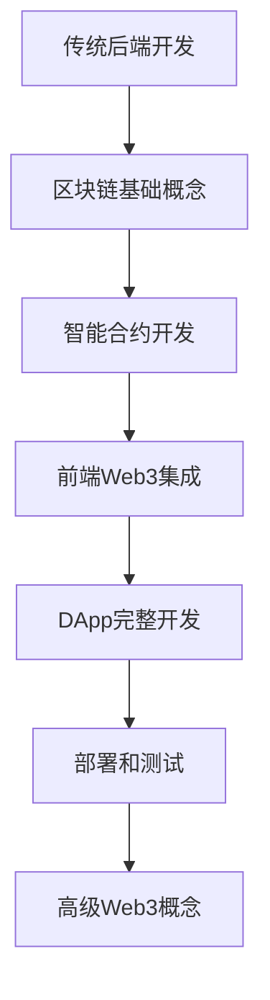

# 🎓 Web3开发学习指南 - 从MovieWrite项目开始

> 专为有Java/Python背景的开发者设计的Web3入门教程

## 📚 学习路径概览



---

## 🔍 第一章：Web3核心概念对比

### 传统开发 vs Web3开发

| 概念 | 传统开发 (Java/Python) | Web3开发 | MovieWrite中的体现 |
|------|------------------------|----------|-------------------|
| **数据存储** | MySQL/PostgreSQL数据库 | 区块链 | 文章和贡献存储在以太坊上 |
| **后端逻辑** | Spring Boot/Django服务器 | 智能合约 | MovieArticle.sol处理业务逻辑 |
| **用户认证** | JWT/Session | 钱包签名 | MetaMask钱包连接 |
| **支付系统** | 支付宝/微信支付 | 加密货币 | MRT代币奖励 |
| **部署** | 云服务器 | 区块链网络 | 部署到以太坊网络 |

### 🎯 关键理解点

1. **去中心化**: 没有中央服务器，数据存储在区块链上
2. **不可篡改**: 一旦写入区块链，数据无法修改
3. **透明性**: 所有交易和数据都是公开可查的
4. **智能合约**: 自动执行的代码，类似于后端API

---

## 🔧 第二章：开发环境和工具链

### 工具对比

| 传统开发工具 | Web3对应工具 | 用途 |
|-------------|-------------|------|
| IntelliJ IDEA/PyCharm | VS Code + Solidity插件 | 代码编辑 |
| Maven/pip | npm/yarn | 包管理 |
| JUnit/pytest | Hardhat测试 | 单元测试 |
| Postman | Hardhat Console | API测试 |
| Docker | Hardhat Network | 本地环境 |

### 🛠 MovieWrite项目工具链

```bash
# 1. Hardhat - 相当于Spring Boot的开发框架
npx hardhat compile    # 编译智能合约 (类似 mvn compile)
npx hardhat test       # 运行测试 (类似 mvn test)
npx hardhat node       # 启动本地区块链 (类似启动本地数据库)

# 2. Next.js - 前端框架
npm run dev           # 启动前端服务 (类似启动Web服务器)

# 3. Ethers.js - 区块链交互库 (类似JDBC)
# 用于连接和操作区块链数据
```

---

## 📝 第三章：智能合约开发 (Solidity)

### Solidity vs Java 语法对比

#### 1. 基本语法

```solidity
// Solidity (类似Java)
pragma solidity ^0.8.20;

contract MovieArticle {
    // 状态变量 (类似Java的成员变量)
    uint256 private _articleIds;
    mapping(uint256 => Article) public articles;
    
    // 结构体 (类似Java的类)
    struct Article {
        uint256 id;
        string title;
        address creator;
        bool isCompleted;
    }
    
    // 修饰符 (类似Java的注解)
    modifier onlyOwner() {
        require(msg.sender == owner(), "Not owner");
        _;
    }
    
    // 函数 (类似Java的方法)
    function createArticle(string memory _title) 
        external 
        returns (uint256) 
    {
        _articleIds++;
        articles[_articleIds] = Article({
            id: _articleIds,
            title: _title,
            creator: msg.sender,
            isCompleted: false
        });
        return _articleIds;
    }
}
```

```java
// 对应的Java代码
@Entity
public class MovieArticle {
    // 成员变量
    private Long articleIds = 0L;
    private Map<Long, Article> articles = new HashMap<>();
    
    // 内部类
    public static class Article {
        private Long id;
        private String title;
        private String creator;
        private Boolean isCompleted;
    }
    
    // 权限检查 (类似修饰符)
    @PreAuthorize("hasRole('OWNER')")
    public Long createArticle(String title, String creator) {
        articleIds++;
        Article article = new Article();
        article.setId(articleIds);
        article.setTitle(title);
        article.setCreator(creator);
        article.setIsCompleted(false);
        articles.put(articleIds, article);
        return articleIds;
    }
}
```

#### 2. 关键概念解释

| Solidity概念 | Java对应概念 | 说明 |
|-------------|-------------|------|
| `mapping` | `HashMap` | 键值对存储 |
| `struct` | `class` | 数据结构 |
| `modifier` | `@Annotation` | 函数修饰符 |
| `require` | `if + throw` | 条件检查 |
| `event` | `Logger` | 事件记录 |
| `msg.sender` | `getCurrentUser()` | 当前调用者 |

### 🎯 MovieArticle.sol 核心逻辑解析

```solidity
// 1. 创建文章 - 类似RESTful API的POST /articles
function createArticle(
    string memory _title,
    string memory _movieTitle,
    string memory _genre,
    uint256 _minContributionLength,
    uint256 _maxContributors
) external returns (uint256) {
    _articleIds++;  // 自增ID (类似数据库自增主键)
    
    // 创建新文章对象 (类似new Article())
    articles[_articleIds] = Article({
        id: _articleIds,
        title: _title,
        movieTitle: _movieTitle,
        genre: _genre,
        creator: msg.sender,  // 当前用户地址
        createdAt: block.timestamp,  // 当前时间戳
        totalContributions: 0,
        totalRewards: 0,
        isCompleted: false,
        minContributionLength: _minContributionLength,
        maxContributors: _maxContributors
    });
    
    // 发出事件 (类似日志记录)
    emit ArticleCreated(_articleIds, msg.sender, _title);
    return _articleIds;
}
```

---

## 🌐 第四章：前端Web3集成

### 传统前端 vs Web3前端

#### 1. 用户认证对比

```javascript
// 传统认证 (JWT)
const login = async (username, password) => {
    const response = await fetch('/api/login', {
        method: 'POST',
        headers: { 'Content-Type': 'application/json' },
        body: JSON.stringify({ username, password })
    });
    const { token } = await response.json();
    localStorage.setItem('token', token);
};

// Web3认证 (钱包连接)
import { useAccount, useConnect } from 'wagmi';

const WalletConnect = () => {
    const { address, isConnected } = useAccount();
    const { connect, connectors } = useConnect();
    
    return (
        <div>
            {isConnected ? (
                <p>已连接: {address}</p>
            ) : (
                <button onClick={() => connect({ connector: connectors[0] })}>
                    连接钱包
                </button>
            )}
        </div>
    );
};
```

#### 2. 数据交互对比

```javascript
// 传统API调用
const createArticle = async (articleData) => {
    const response = await fetch('/api/articles', {
        method: 'POST',
        headers: {
            'Authorization': `Bearer ${token}`,
            'Content-Type': 'application/json'
        },
        body: JSON.stringify(articleData)
    });
    return response.json();
};

// Web3合约调用
import { useContractWrite } from 'wagmi';

const CreateArticle = () => {
    const { write: createArticle } = useContractWrite({
        address: CONTRACT_ADDRESSES.MOVIE_ARTICLE,
        abi: MOVIE_ARTICLE_ABI,
        functionName: 'createArticle',
    });
    
    const handleCreate = () => {
        createArticle({
            args: [title, movieTitle, genre, minLength, maxContributors]
        });
    };
    
    return <button onClick={handleCreate}>创建文章</button>;
};
```

---

## 🧪 第五章：测试和调试

### 测试对比

#### Java测试 vs Solidity测试

```java
// Java JUnit测试
@Test
public void testCreateArticle() {
    MovieArticleService service = new MovieArticleService();
    Long articleId = service.createArticle("Test Title", "user123");
    
    assertNotNull(articleId);
    assertEquals(1L, articleId);
    
    Article article = service.getArticle(articleId);
    assertEquals("Test Title", article.getTitle());
    assertEquals("user123", article.getCreator());
}
```

```javascript
// Solidity Hardhat测试
describe("MovieArticle", function () {
    it("Should create a new article", async function () {
        const [owner] = await ethers.getSigners();
        
        // 部署合约 (类似创建service实例)
        const MovieArticle = await ethers.getContractFactory("MovieArticle");
        const movieArticle = await MovieArticle.deploy(rewardToken.address);
        
        // 调用合约函数
        await expect(
            movieArticle.createArticle("Test Title", "Test Movie", "Drama", 50, 5)
        ).to.emit(movieArticle, "ArticleCreated");
        
        // 验证结果
        const article = await movieArticle.articles(1);
        expect(article.title).to.equal("Test Title");
        expect(article.creator).to.equal(owner.address);
    });
});
```

---

## 🚀 第六章：实战练习

### 练习1：理解智能合约状态

```bash
# 1. 启动本地区块链
npx hardhat node

# 2. 在另一个终端部署合约
npx hardhat run scripts/deploy.js --network localhost

# 3. 使用Hardhat控制台交互
npx hardhat console --network localhost
```

```javascript
// 在控制台中执行
const MovieArticle = await ethers.getContractFactory("MovieArticle");
const movieArticle = await MovieArticle.attach("合约地址");

// 创建文章
await movieArticle.createArticle("我的第一篇文章", "阿凡达", "科幻", 100, 5);

// 查看文章
const article = await movieArticle.articles(1);
console.log(article);

// 查看总文章数
const total = await movieArticle.getTotalArticles();
console.log("总文章数:", total.toString());
```

### 练习2：前端交互

1. **连接钱包**
   - 安装MetaMask浏览器插件
   - 添加本地Hardhat网络
   - 导入测试账户

2. **创建第一篇文章**
   - 访问 http://localhost:3000
   - 连接钱包
   - 填写文章信息并提交

3. **查看交易**
   - 在MetaMask中查看交易历史
   - 在Hardhat控制台查看事件日志

### 练习3：添加新功能

尝试为合约添加一个新功能：文章分类统计

```solidity
// 在MovieArticle.sol中添加
mapping(string => uint256) public genreCount;

function createArticle(...) external returns (uint256) {
    // ... 现有代码 ...
    
    // 新增：统计分类
    genreCount[_genre]++;
    
    // ... 现有代码 ...
}

// 新增函数：获取分类统计
function getGenreCount(string memory _genre) external view returns (uint256) {
    return genreCount[_genre];
}
```

---

## 📖 第七章：进阶概念

### 1. Gas费用理解

```solidity
// Gas费用类比
function expensiveOperation() external {
    // 循环操作消耗更多Gas (类似复杂的数据库查询)
    for(uint i = 0; i < 1000; i++) {
        // 每次存储操作都消耗Gas
        someMapping[i] = i;
    }
}

function efficientOperation() external {
    // 优化的操作消耗更少Gas
    // 类似于优化SQL查询
    uint256 batchValue = calculateBatch();
    someValue = batchValue;
}
```

### 2. 事件和日志

```solidity
// 事件定义 (类似Java的日志)
event ArticleCreated(
    uint256 indexed articleId,
    address indexed creator,
    string title
);

// 发出事件
emit ArticleCreated(newArticleId, msg.sender, _title);
```

```javascript
// 前端监听事件 (类似WebSocket)
const contract = new ethers.Contract(address, abi, provider);

contract.on("ArticleCreated", (articleId, creator, title) => {
    console.log(`新文章创建: ${title} by ${creator}`);
    // 更新UI
    updateArticleList();
});
```

### 3. 安全考虑

| 安全问题 | 传统开发 | Web3开发 | 解决方案 |
|----------|----------|----------|----------|
| **重入攻击** | 并发问题 | 合约重入调用 | ReentrancyGuard |
| **权限控制** | RBAC | 地址权限 | Ownable模式 |
| **输入验证** | 参数校验 | require检查 | 严格的require语句 |
| **整数溢出** | 数值溢出 | uint溢出 | SafeMath库 |

---

## 🎯 第八章：学习路线图

### 初级阶段 (1-2周)
- [ ] 理解区块链基本概念
- [ ] 学习Solidity基础语法
- [ ] 完成MovieWrite项目的部署和测试
- [ ] 理解智能合约的生命周期

### 中级阶段 (2-4周)
- [ ] 深入学习Solidity高级特性
- [ ] 掌握前端Web3集成
- [ ] 学习DeFi协议原理
- [ ] 实践更复杂的智能合约

### 高级阶段 (1-3个月)
- [ ] 学习Layer2解决方案
- [ ] 掌握跨链技术
- [ ] 深入理解MEV和Gas优化
- [ ] 参与开源DeFi项目

---

## 📚 推荐学习资源

### 📖 文档和教程
1. **Solidity官方文档**: https://docs.soliditylang.org/
2. **Hardhat文档**: https://hardhat.org/docs
3. **Ethers.js文档**: https://docs.ethers.io/
4. **OpenZeppelin文档**: https://docs.openzeppelin.com/

### 🎥 视频教程
1. **Solidity基础**: Dapp University
2. **Web3前端开发**: Moralis Academy
3. **DeFi开发**: Eat The Blocks

### 🛠 实践项目
1. **简单代币合约**: ERC20实现
2. **NFT市场**: ERC721 + 交易功能
3. **DeFi协议**: 借贷或DEX
4. **DAO治理**: 投票和提案系统

---

## 🤝 学习建议

### 对于Java/Python开发者

1. **利用现有知识**
   - 面向对象思维适用于智能合约设计
   - 测试驱动开发同样重要
   - 代码审查和安全考虑更加关键

2. **注意差异**
   - 状态变更需要消耗Gas费用
   - 数据一旦上链就不可修改
   - 异步编程模式在前端更重要

3. **学习策略**
   - 先理解概念，再动手实践
   - 多看优秀项目的源码
   - 参与社区讨论和代码审查

### 常见误区

❌ **错误认知**: Web3只是换了个数据库
✅ **正确理解**: Web3是全新的架构模式，需要重新思考应用设计

❌ **错误认知**: 智能合约可以随时修改
✅ **正确理解**: 智能合约部署后不可修改，需要谨慎设计

❌ **错误认知**: Gas费用不重要
✅ **正确理解**: Gas优化是Web3开发的核心技能

---

## 🎉 总结

通过MovieWrite项目，您已经接触到了Web3开发的核心概念：

1. **智能合约开发** - 后端逻辑
2. **前端Web3集成** - 用户界面
3. **测试和部署** - 开发流程
4. **安全考虑** - 最佳实践

继续深入学习，您将能够开发出更复杂和有趣的Web3应用！

---

**💡 记住**: Web3开发不仅仅是技术的转变，更是思维模式的转变。从中心化到去中心化，从信任机构到信任代码，这是一个全新的世界！

**🚀 下一步**: 尝试修改MovieWrite项目，添加您自己的功能，这是最好的学习方式！ 